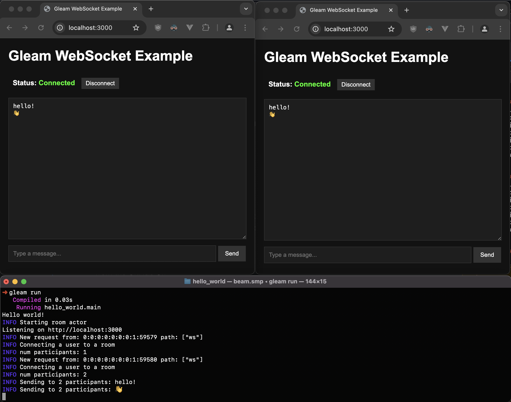

# gleam chat

Learning Gleam. Svelte frontend using types and functions from Gleam.

Sources:
- [connellr023/chatter-reborn](https://github.com/connellr023/chatter-reborn)
- [hayleigh-dot-dev/fosdem-2023](https://github.com/hayleigh-dot-dev/fosdem-2023)
- [bcpeinhardt/learn_otp_with_gleam](https://github.com/bcpeinhardt/learn_otp_with_gleam)
- [Exploring the Gleam FFI - Jonas Hietala](https://www.jonashietala.se/blog/2024/01/11/exploring_the_gleam_ffi)

## Structure
This repo contains 3 projects:
```
./               # gleam module hello_world (backend)
├─ src/shared/   # gleam module shared (shared types)
├─ frontend/     # svelte (frontend)
```
The folder `src/shared` is part of the be project and also it's own project that is built to typescript and [copied to](./frontend/src/generated/) the frontend project. This is a prototype to test code sharing between gleam and typescript.

The [shared module](src/shared/src/shared.gleam) contains type definitions and encode / decode functions for the messages between the fe and be. See how the fe consumes the types at [onMessage](./frontend/src/Chat.svelte#L58) and [sendMessage](./frontend/src/Chat.svelte#L140). End to end types are working: 🎉. Currently, everytime the shared code is edited it needs to be built and copies to the frontend manually with the commands noted below.

## Development

### Setup
Use [asdf](https://asdf-vm.com/guide/getting-started.html) to `asdf install` gleam and other dependencies defined in [.tool-versions](./.tool-versions).

### Easy
```sh
gleam run
```
Open [localhost:3000/test.html](http://localhost:3000/test.html) in your browser.

### Svelte Frontend
```sh
# run backend
gleam run

# build shared types
cd src/shared
gleam build --target javascript
rm -rf ../../frontend/src/generated
cp -r build/dev/javascript ../../frontend/src/generated
cd ../..

# run frontend
cd frontend
bun dev
```

Open: [localhost:3000](http://localhost:3000) in your browser.

## Screenshot

